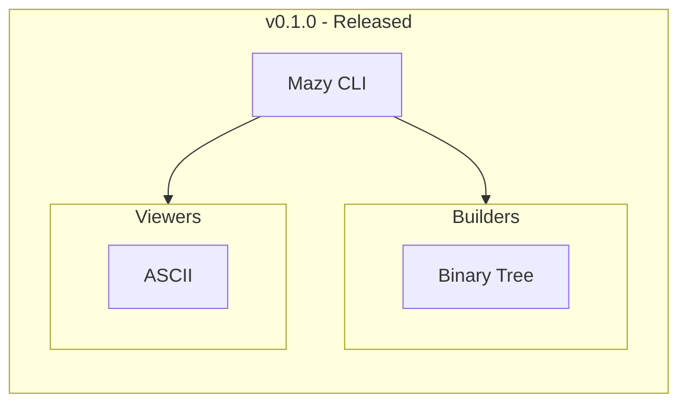
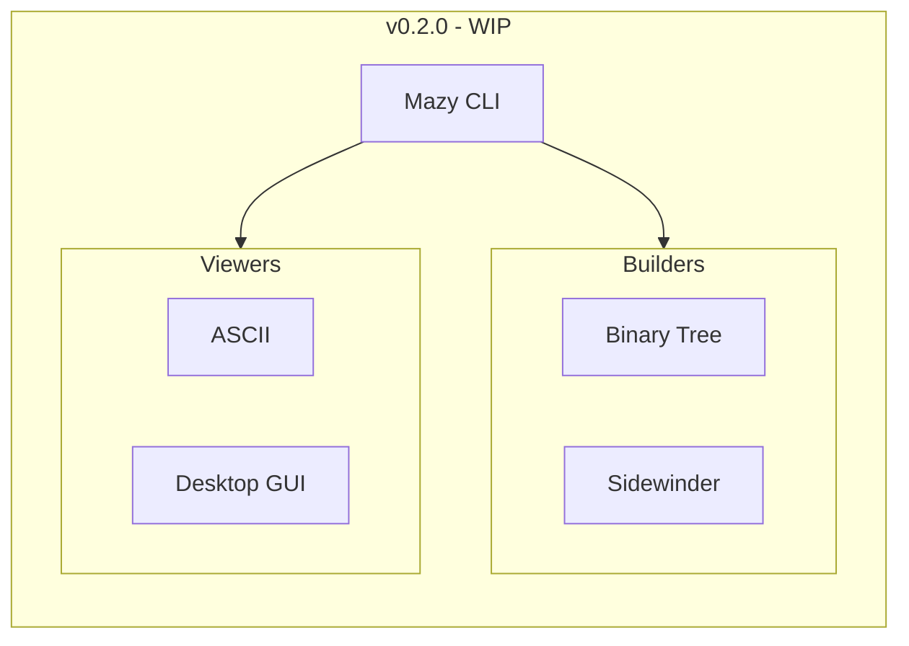

## Mazy

This is an exploratory project to create maze builders and solvers in Python. 

Working with maze algorithms is fun and creates different opportunities to explore problems in Computer Science. 

The project is aimed at students and enthusiasts of maze algorithms. It's also a fun place for Python programmers.

### Getting Started

It's recommended to use Python 3.11 or above:
- Clone the project repository from Github
- From the project's root folder, run `pip install mazy`
- Run `python maze_maker.py`

Additional help is provided using GNU standard -h or --help.

### Release History

---

---

